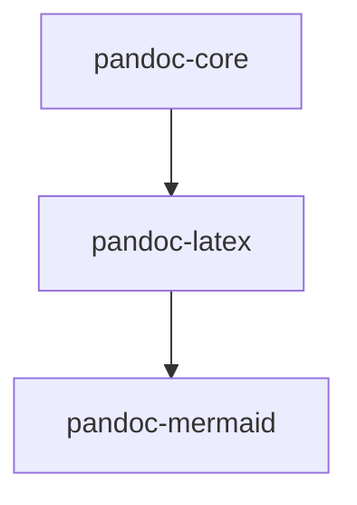

# Pandoc Docker Container

First build the container under Linux or in a git shell in Windows.

```bash
./build.sh
```

Then use it with 

```bash
./pandoc --help
```

Or for developing in the container

```bash
./pandoc --shell
```

If you want to be user root in the pandoc container run with

```bash
./pandoc --shell --root
```


There are three containers

1. **pandoc-core** that is a bare compiled pandoc from sources
2. **pandoc-latex** including a latex distribution e.g. for pdf output
3. **pandoc-mermaid** further extension including the Node.js packet



# Help

Mermaid is not that simple installed on Alpine:
see https://github.com/puppeteer/puppeteer/blob/master/docs/troubleshooting.md#running-on-alpine

